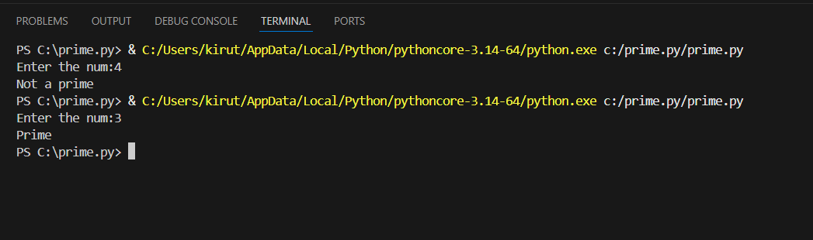

# Python Basics

This repository contains my daily Python practice programs.

---

## Day 1
- Even and Odd Program  
File: [even_odd.py](even_odd.py)

## Day 2
- Prime Number Program  
File: [prime.py](prime.py)

---

## Output Screenshot

---

I am learning Python step by step 🚀
